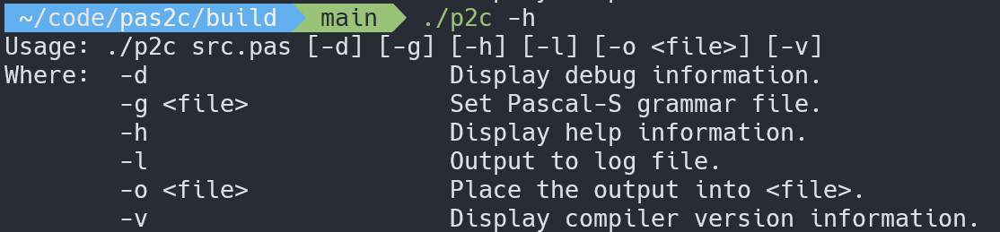
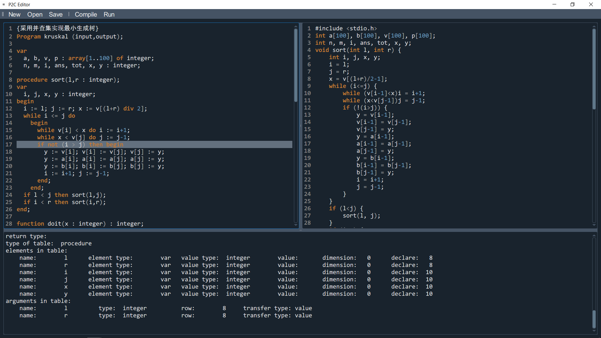

```
                                                                                                    
                                                                                                    
                                                                                                    
                                                                                                    
                                                                                                    
                  
                  &&&&&&&&&&&    &&&&&&&      &&&&&&&&(    %%%%%%%%%    %%%%%%%%#                   
                   &&&&&&&&&&&%  &&&&&&&    &&&&&&&&&&&& %%%%%%%%%%%% /%%%%%%%%%#                   
                   &&&.    &&&%  &&&.&&&(   &&&&    /&&& %%%%     %%% /%%%                          
                   &&&.    &&&% &&&& &&&&   &&&&    /&&& %&&%     %%% /%%%                          
                   &&&.    &&&% &&&& &&&&   (&&&&               %%%%% /%%%                          
                   &&&&&&&&&&&% &&&(  &&&,    /&&&&           &&%%%   /%%%                          
                   &&&&&&&&&&& #&&&   &&&&      *&&&&.      &&&&%     /%%%                          
                   &&&.        &&&&   &&&&        ,&&&&.  &&&&&       /%%%                          
                   &&&.        &&&&%%%%&&&          /&&& %&&&         /&%%                          
                   &&&.       ,&&&&&&&&&&&&         /&&& %&&&         /&%&                          
                   &&&.       &&&&     &&&& &&&&&&&&&&&& %&&&&&&&&&&& /&&&&&&%%%#                   
                   &&&.       &&&&     (&&&  &&&&&&&&&&  &&&&&&&&&&&   &&&&&&&&&#                   
                                                                                                    
                  ...............................................................                   
                                                                                                    
                                                                                                    
                                                                                                    
                                                                                                    
                                                                                                    
```

# Pas2c
<!-- ALL-CONTRIBUTORS-BADGE:START - Do not remove or modify this section -->
[](#contributors-)
<!-- ALL-CONTRIBUTORS-BADGE:END -->
Yet Another Pascal to C Compiler.

## Requirements
- GCC
- CMake
- PyQt5

## Features ✨
- Multi-platform compatibility: Linux, Windows, Mac
- Extended Pascal grammar: eg. `record`
- Custom Pascal grammar with `json`
- Error handling and recovery
- Global log module
- CLI (just like `gcc`)
- GUI with editer

## Roadmap
1. Lexer & Parser
2. Semantic Analyse
3. Code Generate

## CLI Usage


- build:
```sh
mkdir build && cd build
cmake .. && cmake --build .
```
- run (in folder `build`):
    - linux / mac: `./p2c ../example/gcd.pas`
    - win:`.\Debug\p2c.exe ..\example\gcd.pas`
> please specify the path of `grammar.json` with `-g` if not running in `build`.
- test: `ctest`
```sh
> for more info: ctset -VV
```
- release: `cpack`

## GUI


## Future Work
- Syntax tree visualization
- CLI: more portable
- GUI: robustness

## Contributors
<!-- ALL-CONTRIBUTORS-LIST:START - Do not remove or modify this section -->
<!-- prettier-ignore-start -->
<!-- markdownlint-disable -->
<table>
  <tr>
    <td align="center"><a href="https://github.com/ztqakita"><br /><sub><b>Brandon Zhang</b></sub></a><br /><a href="https://github.com/ZubinGou/pas2c/commits?author=ztqakita" title="Code">💻</a> <a href="https://github.com/ZubinGou/pas2c/commits?author=ztqakita" title="Tests">⚠️</a> <a href="https://github.com/ZubinGou/pas2c/commits?author=ztqakita" title="Documentation">📖</a></td>
  </tr>
</table>

<!-- markdownlint-restore -->
<!-- prettier-ignore-end -->

<!-- ALL-CONTRIBUTORS-LIST:END -->